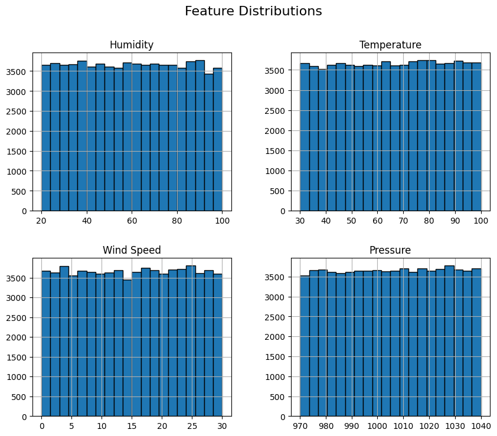
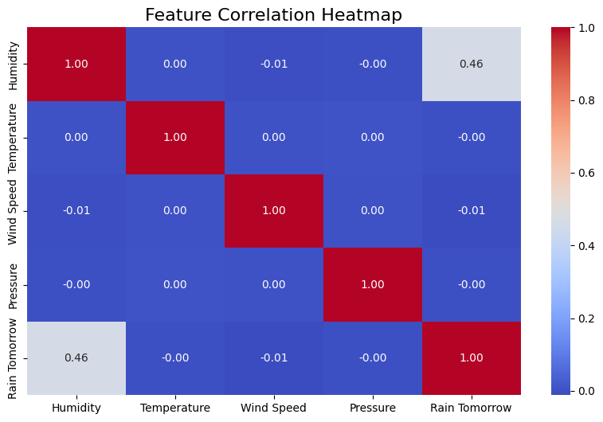
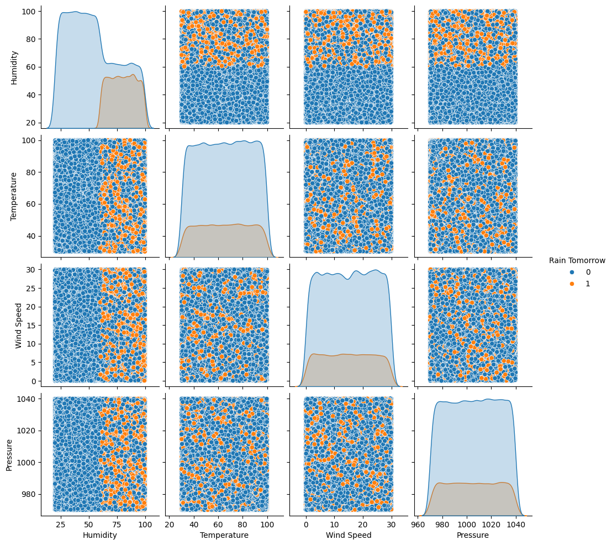

# 🌦️ Naïve Bayes Weather Forecast App

This project is a **Streamlit web application** that predicts whether it will rain tomorrow using a **Naïve Bayes classifier**.  
The model is trained on the **USA Rainfall Prediction Dataset (2024–2025)** and uses features such as humidity, temperature, wind speed, and pressure.  

---

## 🚀 Features
- 📊 Explore the rainfall dataset with an interactive dashboard  
- 🤖 Train and evaluate a **Naïve Bayes model**  
- 📈 View performance metrics (Accuracy, Confusion Matrix, Classification Report)  
- 🌤️ Make custom predictions for tomorrow's weather using sliders  
- 💾 Save the trained model with **pickle**  

---

## 📊 Workflow
1. **Dataset Overview**  
   - Columns: `Date`, `Location`, `Temperature`, `Humidity`, `Wind Speed`, `Precipitation`, `Cloud Cover`, `Pressure`, `Rain Tomorrow`  
   - Missing values handled by replacing with mean  

2. **Model Training**  
   - Features used: `Humidity`, `Temperature`, `Wind Speed`, `Pressure`  
   - Target: `Rain Tomorrow` (Yes/No)  
   - Algorithm: **Gaussian Naïve Bayes**  

3. **Model Evaluation**  
   - Accuracy Score  
   - Confusion Matrix  
   - Precision, Recall, F1-score  

4. **Prediction**  
   - Input values: Humidity, Temperature, Wind Speed, Pressure  
   - Output:  
     - 🌧️ Yes, it will rain tomorrow  
     - ☀️ No, it will not rain tomorrow  

---

## 📊 Visualizations

### 1️⃣ Feature Distribution Histogram
Shows how weather features are distributed:  

---

### 2️⃣ Feature Correlation Heatmap
Highlights relationships between features:  

---

### 3️⃣ Pairplot
Visualizes feature interactions and class separation:  

---

### 4️⃣ Confusion Matrix
Evaluates classification performance:  

---

### 5️⃣ Gradio App Screenshot
Screenshot of the interactive weather prediction app:  

---

## 🌤️ Example Prediction
**Input:**  
- Humidity = 75  
- Temperature = 28 °C  
- Wind Speed = 12 km/h  
- Pressure = 1010 hPa  

**Output:**  
- ☀️ No, it will not rain tomorrow.

---

## 📌 Conclusion
This project demonstrates how a **Naïve Bayes classifier** can be applied to weather forecasting.  
Although simple and fast, its accuracy can be enhanced by:  
- Adding more features (cloud cover, precipitation, seasonal effects)  
- Using advanced models (Random Forest, Gradient Boosting, XGBoost)  
- Applying feature engineering and hyperparameter tuning
# Naive-Bayes-Weather-Forecast
